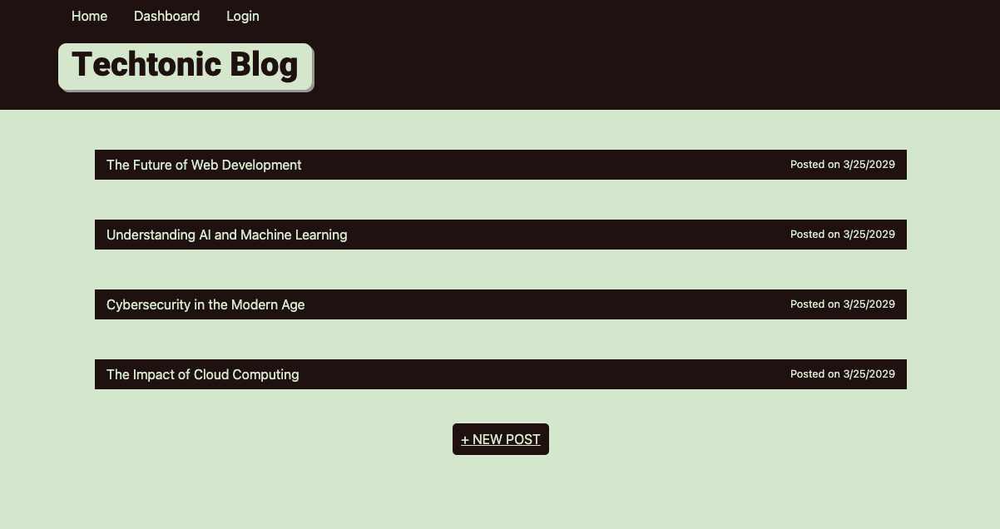

# Techtonic

## Description

Techtonic is a tech blog where all you need to do to get started is jump in, create an account, get posting, engage with others and build it up!

## Screenshot

## Table of Contents 

- [Installation](#installation)
- [Usage](#usage)
- [Credits](#credits)
- [License](#license)

## Installation

How do I install Dependencies?
npm i

## Usage

Use this web app for traditional blog posting.

## Credits

## License 

This project is licensed under the MIT License.

Find more about this license here: https://opensource.org/licenses/MIT.

        

## Tests

How do I run tests?
No Testing

## Questions

Please direct your questions towards Ben at:
Github: zaczacariah
Email: ben-zac@outlook.com

    